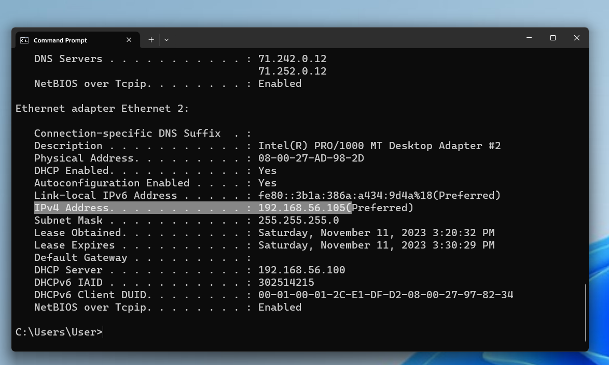
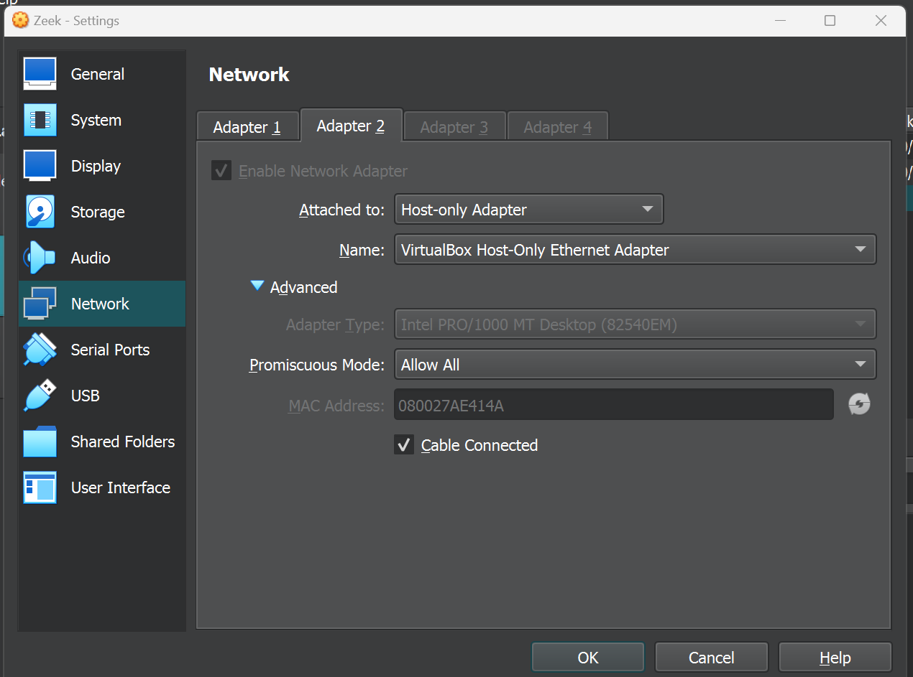

# Elastic Detection Lab


## Table of Contents
- [Project Introduction and Overview](XXXXX)
- [Getting Started](XXXXX)
    - [Setup Requirements](XXXXX)
    - [VM Network Settings](XXXX)
    - [Local Environment Network Schema](XXXX)
- [Virtual Machine Setup](XXX)
    - [Oracle VirtualBox](XXX)
    - [ParrotOS (Attacker)](XXX)
        - [Install and Network Configuration](XXX)
        - [Updates and Prep](XXX)
        - [IP Address](XXX)
    - [Windows 11 (Target Victim)](XXX)
        - [Install and Network Configuration](XXX)
        - [Windows Defender Settings](XXXX)
        - [Installing Elastic Agents](XXX)
        - [Installing and Configuring Sysmon](XXX)
        - [Increasing Visability on PowerShell Script Execution](XXX)
        - [IP Address](XXX)
    - [Ubuntu (Zeek/Network Traffic Analyzer)](XXX)
        - [Install and Network Configuration](XXX)
        - [Updates and Prep](XXX)
        - [IP Address](XXX)
    - [Testing Local Network Connectivity](XXX)
- [SIEM Setup](XXXX)
    - [Elastic Cloud Overview](XXXX)
    - [Elastic Agent Installation](XXX)
    - [Windows Sysmon Install and Configuration](XXX)
    - [PowerShell Visibility](XXXX)
- [Alert Scenario 1](XXXX)
- [Alert Scenario 2](XXXX)
- [Alert Scenario 3](XXXX)

## Project and Repo Overview

This repo is my personal recap and walkthrough of a introductory hands-on course by TCM Security on Detection Engineering. The course and project focuses on staging a local network environment consisting of three virtual machines (VM) which play the role of Attacker, Target Victim, and Zeek/Network Traffic Analyzer, and the implementation of Elastic Cloud (trial version) as the SIEM of choice, which will be utilized to create and test detection alerts for various scenarios.

The current version of this repo highlights the local environment/VM/SIEM setup, installing agents to collect logs, and testing Elastic queries and alerts. A future pending update will cover TOML, uploading detections to Github, and programtically pushing alerts to Elastic Cloud. 

While this recap/walkthrough will briefly touch upon setting up the lab environment and settings, the primary focus is on using Elastic Cloud as a SIEM and creating alert detection. This recap/walkthrough aims to showcase a hands-on demonstration of successfully completing the course while highlighting a comprehensive understanding of its contents and the essential/fundamental principles of detection engineering.


## Getting Started


### Setup Requirements
The project requires the use of a hypervisor to house three VMs (Ubuntu, ParrotOS, Windows 11). While any hypervisor can work, the hypervisor of choice within this project will be Oracle VM VirtualBox.

A SIEM will also need to be implemented which will collect logs from the Ubuntu and Windows 11 hosts. There are several SIEMs to choose from and could be incorporated. However for the scope of this project, the SIEM of choice will be Elastic Cloud (trial version).

The Linux VM is needed to install and run Zeek, which will collect logs on HTTP/network traffic within our local environment network. While any Linux distro should work, the distro of choice for this project is Ubuntu.

The Attacker VM is needed to conduct interactions with the Target Victim VM, such as port scanning, sending over malicious files, remote PowerShell script execution, and establishing a reverse remote shell connection. These activities aim to trigger and validate our alert detections. The Attacker VM of choice for this project is ParrotOS - alternatively Kali Linux can be used as the Attacker VM. More importantly, the tools needed for the Attacker VM is nmap, OWASP ZAP, Nikto, and Metasploit.

The Target Victim VM is needed to be on the receiving end of the Attacker VM's activities. The Target Victim VM will have Elastic agents installed which will help to forward logs to our instance of Elastic Cloud. The choice of the Target Victim VM will be Windows 11. Additional requirements will include the installation of Windows Sysmon as an additional log source and configurations to improve PowerShell script execution visability.


### VM Network Settings
For the VMs to be able to communicate to each other within a safe and contained local network environment, an additional network adapter needs to be added in VirtualBox's network settings. ParrotOS and Windows 11 will need to have Adapter 2 attached to "Host-only Adapter" to "VirtualBox Host-Only Ethernet Adapter", while Zeek will need to have Adapter 2 

Please see the respective host setup under Lab Setup for additional clarity and instructions.


### Local Environment Network Schema


## Virtual Machine Setup

### Oracle VirtualBox


### ParrotOS (Attacker)

#### Install and Network Configuration

The Security Edition of ParrotOS can be downloaded at https://parrotsec.org/download/. See Download button and select the virtualbox (amd64) option. After the .ova file is finished downloading, you can open the file directly to open it in VirtualBox and complete the VM installation.

Once ParrotOS is fully imported as a VM inside of VirtualBox, change to network settings to enable Adapter 2 attached to "Host-only Adapter" to "Virtual Box Host-Only Ethernet Adapter". This will allow ParrotOS to communicate and interact with other VMs with the same network configurations in a safe and contained local network environment.


#### Updates and Prep

Ensure that your OS is fully updated and has the tools needed by running the below commands. Sudo password should be `parrot`.

```
sudo apt-get update
sudo apt-get upgrade
```

```
sudo apt install vsftpd
```

```
sudo apt install ftpd
```


#### IP Address

We'll need to know what the IP address is for our ParrotOS host. To find it, open a terminal and run the `ip addr` command. The IP address for the ParrotOS host can be found next to "inet" under "3: enp0s8". For my particular VM, it is `192.168.56.104`.


### Windows 11 (Victim)

#### Install and Network Configuration

The file for Windows 11 VM install can be found at https://developer.microsoft.com/en-us/windows/downloads/virtual-machines/. 

Navigate to the above link and select the VirtualBox option to download a .zip file. Extract the .ova file within and open it (it should open directly in VirtualBox) to begin the VM installation.

Once Windows 11 is fully imported as a VM inside of VirtualBox, change to network settings to enable Adapter 2 attached to "Host-only Adapter" to "Virtual Box Host-Only Ethernet Adapter". This will allow ParrotOS to communicate and interact with other VMs with the same network configurations in a safe and contained local network environment.


#### Windows Defender Settings

To ensure that we're able to fully test malicious activity against our Windows 11 host, we'll need to configure (or 'misconfigure') some settings. The below will need to be completed in order to allow the full execution of testing activities and subsuqent triggering of alerts.

Virus and Threat Protection Settings
- Tamper Protection: Off

Local Group Policy Editor > Computer Configuration > Administrative Templates > Windows Components > Microsoft Defender Antivirus
- Turn off Microsoft Defender Antivirus: Enabled


Local Group Policy Editor > Computer Configuration > Administrative Templates > Windows Components > Microsoft Defender Antivirus > Real-time Protection
- Turn off real-time protection: Enabled
- Turn on behavioral monitoring: Enabled


#### Installing Elastic Agent


#### Installing and Configuring Sysmon


#### Increasing Visability on PowerShell Script Execution


#### IP Address

We'll need to know what the IP address is for our Windows 11 host. To find it, open a terminal and run the `ipconfig /all` command. The IP address for the Windows 11 host can be found next to "IPv4 Address". For my particular VM, it is `192.168.56.105`.




### Ubuntu (Zeek/Network Traffic Analyzer)

#### Install and Network Configuration

The installation of Ubuntu VM is different from the others in that we are not importing a .ova file. Instead we'll need to download a Ubuntu .iso file and manually set it up within VirtualBox. The .iso file can be downloaded at https://ubuntu.com/download/desktop.

Navigate to the above link and select download under Ubuntu LTS (Long Term Support). Then you'll follow the typical steps of creating a new VM within VirtualBox (Create Virtual Machine) and select the downloaded Ubuntu .iso file as the specified ISO Image. For this install, you will also specify your own Ubuntu username and password. Once the new VM setup is complete, it may auto-run. Finish the typical OS installation and you may power off the VM to configure and apply the local network settings.

Within the VirtualBox network settings for the Ubuntu VM, enable Adapter 2 and attach it to "Host-only Adapter" with the name "VirtualBox Host-Only Ethernet Adapter". Additionally, under the Advanced configurations, change the selected choice to "Allow All". This setting is critical in installing Zeek and allowing it to listen to all network traffic within the local network environment. 



#### Zeek Install and Configuration

Documentation for installing and configuring Zeek can be found at https://docs.zeek.org/en/master/install.html.

Ensure that you install `curl` by running the command `sudo apt-install curl` before running any install commands from the Zeek documentation.

While Zeek is a critical component of the overall project, the specific details on configuration is outside the scope of this repo which is primarily focused on the generally setting up the local network environment, Elastic Cloud, and detection engineering. Please refer to Zeek documentation on how to fully setup and configure Zeek.


#### IP Address

We'll need to know what the IP address is for our Ubuntu/Zeek host. To find it, open a terminal and run the `ip addr` command. The IP address for the Ubuntu/Zeek host can be found next to "inet" under "3: enp0s8". For my particular VM, it is `192.168.56.103`.


## SIEM Setup


## Alert Scenario 1


## Alert Scenario 2


## Alert Scenario 3